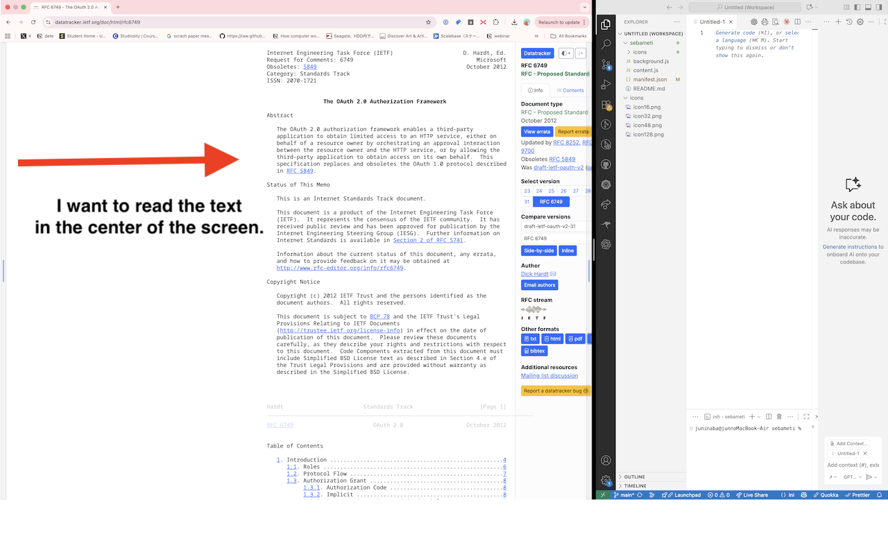

# sebameti

sebameti is a Chrome extension that reshapes the visible page content without changing the browser window size. It is built for setups where you place Chrome on the left half of a full-screen pair of apps and want long-form text to sit closer to the center instead of hugging the left edge. By trimming horizontal width and recentring the column, articles and documentation remain readable even on wide monitors.

Features:

- Click the browser action to show adjustment handles pinned to the left and right edge of the page.
- Drag either handle to increase or decrease the page padding on that side in real time.
- Double-click a handle to instantly reset the padding on its side.
